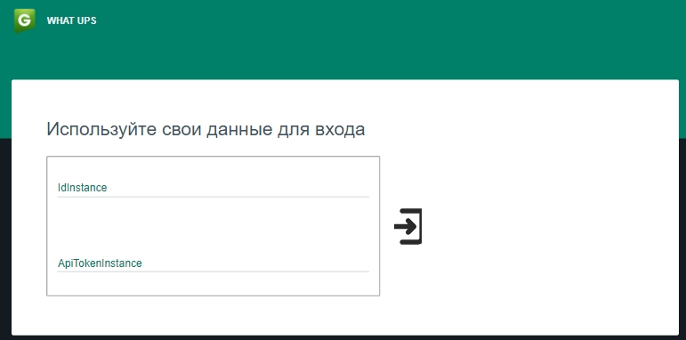
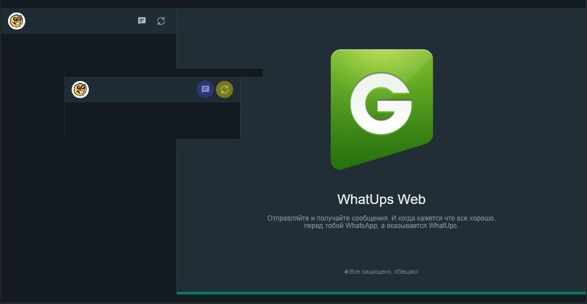
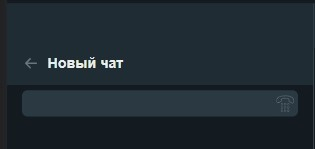
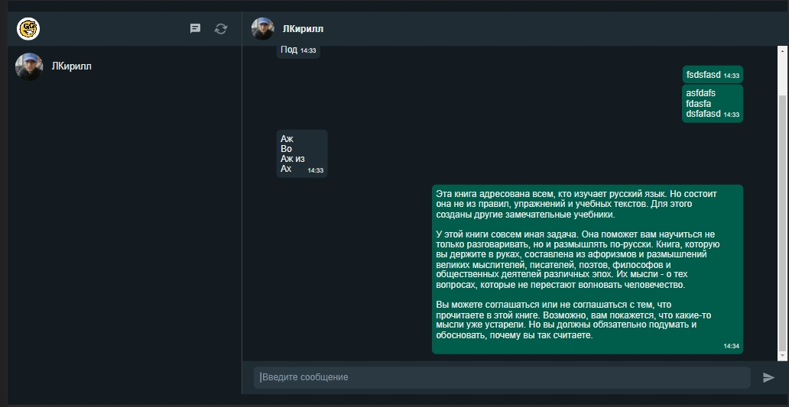

# WHAT-UPS

| React | TypeScript | SCSS | БЭМ |
| ----- | ---------- | ---- | --- |

Приложение дублирующее некоторый функционал web версии whatsapp, и повторяет его дизайн.\
В качестве API решение от [Green Api]([https://green-api.com/]).

## Инструкция:

1. Для использования приложения потребуются данные, полученные после авторизации в [Green Api]([https://green-api.com/]). При отправке запроса появляется `loader`.\
При ошибках на данном этапе предусмотрено индикация ошибки.

2. После успешного входа пользователя встречает окно с интерфейсом из аватара аккаунта и двумя интерактивными элементами управления приложением: создание чата и обновление состояниями чатов.

3. При нажатии на кнопку "новый чат" появляется панель для ввода номера телефона, после нажатия на `Enter` или имеющеюся кнопку. При отсутствии номера в `WhatsApp` появится соответствующее сообщение. Если номер зарегистрирован в `WhatsApp` то появится карточка с его аватаром и именем.
При нажатии на эту карточку откроется новый чат.

4. Отправлять сообщения можно с помощью кнопки "Отправить" или клавишей `Enter`. Сообщения сохраняют форматирование. Перевод строки можно сделать комбинацией `CTRL+Enter`. Время отправки сообщения отображается в карточке с сообщением. 

5. Процесс отправления запроса за уведомлениями о сообщениях сопровождается индикацией кнопки "`Обновить`". Интервал для запросов 10 секунд. Нажатие кнопки `Обновить` отправляет запрос и сбрасывает таймер. Во время активного запроса возможность отправить дубль запроса заблокирована.

6. Возможно создание нескольких чатов и переключение между ними.

## Особенности: 
- состояние аутентификации не сохраняется;
- верстка адекватно себя ведет при ширине разрешения выше `700px`;
- запросы на отправление и получение сообщений происходят через HTTP.
- в вёрстке руководствовался БЭМом.

## BUGS
- сообщения в чате участвуют в гонке, первее тот, кто первый попал в массив сообщений;
- не работает scroll в поле ввода сообщения; 

Ссылка для посмотреть
[LINK](https://whatups.klazar.online)